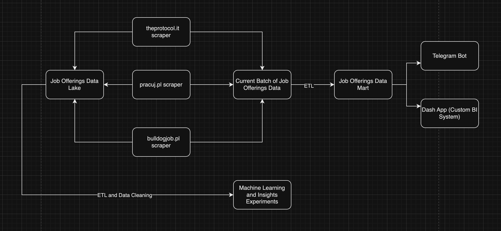

# 🇵🇱 IT Jobs Aggregator 🇵🇱

Welcome to my first big project, on which I have spent more than 2 months of my life. This is a Polish IT jobs aggregator, designed to help job seekers find their dream positions in the IT industry.

## Project Overview

This program starts with web scraping, accessing the three main IT job posting websites in Poland:
1. [pracuj.pl](https://www.pracuj.pl)
2. [buldogjob.pl](https://buldogjob.pl)
3. [theprotocol.it](https://theprotocol.it)

The program retrieves all the data about IT jobs posted daily. The entire job-scraping process takes about two hours.

After collecting the data, it is stored in two different databases:
1. **Historical Data Lake (Backup Table)**: Stores all raw data to ensure nothing is lost.
2. **Current Batch Table**: Stores data for preprocessing.

The data then undergoes an ETL (Extract, Transform, Load) or preprocessing step where it gets formatted and standardized. Insights are extracted from this data. The backup table is crucial in case something happens to the final preprocessed data, allowing for recovery of information from the last month.

After preprocessing, the data is saved to the main jobs table, which contains all jobs (expired and not expired) in a standardized format.

## Web Services

The project offers two web services:

1. **Dash App**: A local web application that you can access if you run the program on your own computer.

2. **Telegram Bot** : A detailed and convenient bot that allows you to:
   - Access all data through graphs
   - Download data in Excel or CSV format
   - Apply filters to the data (Experience Level , Role , City, Region, Language, Work Type)
   - Filter out only non-expired data or get all historical data
   - Change graphs to light or dark theme
   - Set daily alarms to receive information about new job postings matching your filters

3. **Automated Email Updates** : The program includes automatic email sending capabilities::
   - Email notifications about program execution and all preprocessing statuses are sent automatically to the host email.
   - Daily Update emails are sent to users, providing them with the latest job postings and relevant information.

## Project Potential

While the program may not be perfect and the code could be improved, the idea has great potential. This program can serve as a skeleton for new ideas in different areas. For example, it could be adapted to create a database of all flats in Poland (currently experiencing a boom). By rewriting the scrapers for relevant websites, changing database fields, and adjusting the filters, you could create a similar system for another sphere.

## Future Development

The current version of the program has room for improvement. Some algorithms could be optimized, and the bot has some bugs that need to be addressed. Due to time constraints (job searching and CS studies), major updates are not expected until next summer. However, this project has provided valuable experience in database handling, SQL, web scraping, and analytical Python tools like pandas, numpy, and dash.

## Things to Add
* Windows instructions and scripts
* Polish and Russian languages
* An additional table and analysis on companies
* Improved bot keyboard layout
* Proper naming conventions in all files, and optimization of the code
* Add justjoin.it scraper
* Increase refresh rate from daily to hourly


## Project Schema



## How to start this program:

1. **Install Python 3.11.6**

   - **For macOS:**
     - Using Homebrew:
       ```bash
       brew install python@3.11
       ```
     - Alternatively, download the installer from the [official Python website](https://www.python.org/downloads/) and run it.

   - **For Linux:**
     ```bash
     # Update package list and install dependencies:
     sudo apt update

     sudo apt install -y make build-essential libssl-dev zlib1g-dev \
     libbz2-dev libreadline-dev libsqlite3-dev wget curl llvm \
     libncursesw5-dev xz-utils tk-dev libxml2-dev libxmlsec1-dev \
     libffi-dev liblzma-dev

     # Install pyenv:
     curl https://pyenv.run | bash

     # Add pyenv to your shell configuration:
     echo -e 'export PYENV_ROOT="$HOME/.pyenv"\nexport PATH="$PYENV_ROOT/bin:$PATH"' >> ~/.bashrc
     echo -e 'eval "$(pyenv init --path)"\neval "$(pyenv init -)"' >> ~/.bashrc

     # For Zsh users, use this instead:
     echo -e 'export PYENV_ROOT="$HOME/.pyenv"\nexport PATH="$PYENV_ROOT/bin:$PATH"' >> ~/.zshrc
     echo -e 'eval "$(pyenv init --path)"\neval "$(pyenv init -)"' >> ~/.zshrc

     # Refresh your shell:
     exec "$SHELL"

     # Install Python 3.11.6 with pyenv:
     pyenv install 3.11.6
     pyenv global 3.11.6
     ```


2. **Clone this repository and navigate to the directory**
   ```bash
   git clonehttps://github.com/makararena/Polish-IT-Jobs-Aggregator.git
   cd Polish-IT-Jobs-Aggregator
   ```

3. **Set up PostgreSQL**

   - **For macOS:**
     - **Install PostgreSQL:**
       ```bash
       brew install postgresql
       ```
     - **Start the PostgreSQL service:**
       ```bash
       brew services start postgresql
       ```
     - **Create a new PostgreSQL database and user:**
       ```bash
       createdb polish_it_jobs_aggregator
       psql -c "CREATE USER your_user WITH PASSWORD 'your_password';"
       psql -c "GRANT ALL PRIVILEGES ON DATABASE polish_it_jobs_aggregator TO your_user;"
       ```

   - **For Linux:**
     - **Install PostgreSQL:**
       ```bash
       sudo apt update
       sudo apt install -y postgresql postgresql-contrib
       ```
     - **Start the PostgreSQL service:**
       ```bash
       sudo systemctl start postgresql
       ```
     - **Enable PostgreSQL to start on boot:**
       ```bash
       sudo systemctl enable postgresql
       ```
     - **Create a new PostgreSQL database and user:**
       ```bash
       sudo -u postgres psql -c "CREATE DATABASE polish_it_jobs_aggregator;"
       sudo -u postgres psql -c "CREATE USER your_user WITH PASSWORD 'your_password';"
       sudo -u postgres psql -c "GRANT ALL PRIVILEGES ON DATABASE polish_it_jobs_aggregator TO your_user;"
       ```

   - **Verify PostgreSQL installation and connectivity:**
     - **On macOS and Linux:**
       ```bash
       psql -U your_user -d polish_it_jobs_aggregator -c "\dt"
       ```

4. **Create Tables in PostgreSQL**  
   Open your PostgreSQL instance and run the following SQL commands to create the necessary tables:

   ```sql
   -- This is the main table where all the preprocessed job data is stored
   CREATE TABLE jobs (
       id varchar NOT NULL,
       job_title varchar NULL,
       core_role varchar NULL,
       employer_name varchar NULL,
       city varchar NULL,
       lat varchar NULL,
       long varchar NULL,
       region varchar NULL,
       start_salary float8 NULL,
       max_salary float8 NULL,
       technologies_used text NULL,
       worker_responsibilities text NULL,
       job_requirements text NULL,
       offering text NULL,
       benefits text NULL,
       work_life_balance int4 NULL,
       financial_rewards_and_benefits int4 NULL,
       health_and_wellbeing int4 NULL,
       personal_and_professional_development int4 NULL,
       workplace_environment_and_culture int4 NULL,
       mobility_and_transport int4 NULL,
       unique_benefits int4 NULL,
       community_and_social_initiatives int4 NULL,
       b2b_contract int4 NULL,
       employment_contract int4 NULL,
       mandate_contract int4 NULL,
       substitution_agreement int4 NULL,
       work_contract int4 NULL,
       agency_agreement int4 NULL,
       temporary_staffing_agreement int4 NULL,
       specific_work_contract int4 NULL,
       internship_apprenticeship_contract int4 NULL,
       temporary_employment_contract int4 NULL,
       language_english int4 NULL,
       language_german int4 NULL,
       language_french int4 NULL,
       language_spanish int4 NULL,
       language_italian int4 NULL,
       language_dutch int4 NULL,
       language_russian int4 NULL,
       language_chinese_mandarin int4 NULL,
       language_japanese int4 NULL,
       language_portuguese int4 NULL,
       language_swedish int4 NULL,
       language_danish int4 NULL,
       internship int4 NULL,
       junior int4 NULL,
       middle int4 NULL,
       senior int4 NULL,
       "lead" int4 NULL,
       full_time int4 NULL,
       hybrid int4 NULL,
       remote int4 NULL,
       upload_id text NULL,
       expiration date NULL,
       url text NULL,
       date_posted date NULL,
       CONSTRAINT jobs_pkey PRIMARY KEY (id)
   );

   -- This table stores daily job data for processing. It is reset after each batch
   CREATE TABLE jobs_upload (
       id serial4 NOT NULL,
       job_title varchar NULL,
       employer_name varchar NULL,
       "location" varchar NULL,
       hybryd_full_remote varchar NULL,
       expiration varchar NULL,
       contract_type varchar NULL,
       experience_level varchar NULL,
       salary varchar NULL,
       technologies text NULL,
       responsibilities text NULL,
       requirements text NULL,
       offering text NULL,
       benefits text NULL,
       url varchar NULL,
       date_posted timestamp NULL,
       upload_id varchar NULL,
       CONSTRAINT jobs_upload_pkey PRIMARY KEY (id)
   );

   -- This is the backup table. It stores job data to revert to a previous state if needed
   CREATE TABLE jobs_upload_backup (
       id serial4 NOT NULL,
       job_title varchar NULL,
       employer_name varchar NULL,
       "location" varchar NULL,
       hybryd_full_remote varchar NULL,
       expiration varchar NULL,
       contract_type varchar NULL,
       experience_level varchar NULL,
       salary varchar NULL,
       technologies text NULL,
       responsibilities text NULL,
       requirements text NULL,
       offering text NULL,
       benefits text NULL,
       url varchar NULL,
       date_posted timestamp NULL,
       upload_id varchar NULL,
       CONSTRAINT jobs_upload_backup_pkey PRIMARY KEY (id)
   );

   -- This table stores user filters for sending daily updates
   CREATE TABLE user_data (
       user_id int8 NOT NULL,
       filters jsonb NULL,
       CONSTRAINT user_data_pkey PRIMARY KEY (user_id)
   );

   -- This table stores user data to preserve bot state before exit and restore it later
   CREATE TABLE user_data_before_exit (
       chat_id int8 NOT NULL,
       state jsonb NULL,
       filters jsonb NULL,
       CONSTRAINT user_data_before_exit_pkey PRIMARY KEY (chat_id)
   );

   -- This table stores user reviews
   CREATE TABLE user_reviews (
       id serial4 NOT NULL,
       chat_id int8 NOT NULL,
       username varchar(50) NULL,
       user_name varchar(100) NULL,
       review text NULL,
       rating int4 NULL,
       review_type varchar(50) NULL,
       chat_type varchar(50) NULL,
       created_at timestamp DEFAULT CURRENT_TIMESTAMP NULL,
       CONSTRAINT user_reviews_pkey PRIMARY KEY (id),
       CONSTRAINT user_reviews_rating_check CHECK (((rating >= 1) AND (rating <= 5)))
   );

   -- This table is for storing daily report figures
     CREATE TABLE daily_report (
         generation_id VARCHAR(50) PRIMARY KEY,
         benefits_pie_chart BYTEA,
         city_bubbles_chart BYTEA,
         city_pie_chart BYTEA,
         employer_bar_chart BYTEA,
         employment_type_pie_chart BYTEA,
         experience_level_bar_chart BYTEA,
         languages_bar_chart BYTEA,
         salary_box_plot BYTEA,
         poland_map BYTEA,
         positions_bar_chart BYTEA,
         technologies_bar_chart BYTEA,
         summary TEXT
     );

    -- Drop the main table if it exists
      DROP TABLE IF EXISTS jobs;
      DROP TABLE IF EXISTS jobs_upload;
      DROP TABLE IF EXISTS jobs_upload_backup;
      DROP TABLE IF EXISTS user_data;
      DROP TABLE IF EXISTS user_data_before_exit;
      DROP TABLE IF EXISTS user_reviews;
      DROP TABLE IF EXISTS daily_report;
    ```
5. **Add execute permissions to scripts**
  - For macOS and Linux:
    ```bash
    chmod +x main.sh
    chmod +x control_bot.sh
    ```

6. **Create .env file**
  - Create a file named `.env` in the root directory of the project with the following content:
    ```plaintext
    TELEGRAM_TOKEN=your_telegram_bot_token
    DB_PASSWORD=your_database_password
    EMAIL_PASSWORD=your_email_password
    ```

7. **Run the script**
    ```bash
    ./main.sh
    ```

8. **Set up automated script execution**
  - For macOS and Linux:
    Run `crontab -e` and add the following line:
    ```
    00 2 * * * ~/pathto/Polish-IT-Jobs-Aggregator/main.sh ~/pathto/Polish-IT-Jobs-Aggregator >> ~/pathto/Polish-IT-Jobs-Aggregator/logs/main.log 2>&1
    ```


This setup will allow you to run the Work-Analysis project on macOS, and Linux systems, with automated daily execution.
